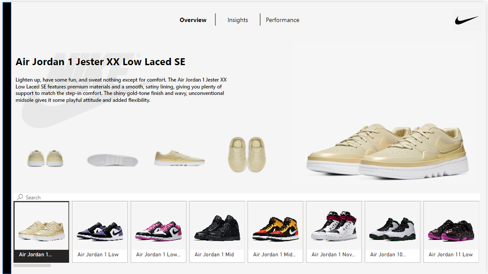

# Nike Sales Dashboard 2021

## Overview

This project involves the creation of an interactive Nike Sales Dashboard for the year 2021. The dashboard incorporates insights, performance metrics, and various visuals derived from the Nike US Sales Dataset and the nike_2020_04_13 dataset.

### Interactive Dashboard Link
[Link to Interactive Dashboard](#)

## Task List
- **Download dataset**
- **Loading Dataset**
- **Perform data cleaning using Power Query**
- **Data modeling, attaching, and making connections between tables**
- **Making calendar table**
- **Creation of key measure table using DAX**
- **Dashboard creation**

## About the Dataset

The dashboard utilizes two tables: `Nike US Sales Dataset` and `nike_2020_04_13`. These datasets contain information about different Nike shoes sold in the USA between 2020 and 2021.

### Nike US Sales Dataset Features

| Feature           | Description                               |
|-------------------|-------------------------------------------|
| Brand             | Name of the Brand                         |
| Retail ID         | Unique ID for retail purposes              |
| Invoice Date      | Date of the sales invoice                  |
| Region            | Region of USA where the product was sold  |
| State             | State of USA where the product was sold   |
| City              | City of USA where the product was sold    |
| Unit Sold         | Number of units sold                       |
| Operating Profit  | Profit generated from the sale             |
| Operating Margin  | Profit margin percentage                   |
| Sales Method      | Method used for the sale (e.g., online, in-store) |
| Product Name      | Name of the Nike product                   |
| Product ID        | Unique ID for the Nike product             |

### nike_2020_04_13 Features

| Feature          | Description                           |
|------------------|---------------------------------------|
| URL              | Product Landing page on website        |
| Product Name     | Name of the product                    |
| Product ID       | Unique ID for the product              |
| Listing Price    | Price at which the product was Listed |
| Sale Price       | Price at which the product was sold   |
| Discount         | Discount if any                       |
| Brand            | Brand name of the product              |
| Description      | Description of the product             |
| Rating           | Rating received by the product         |
| Reviews          | Review of the product                  |
| Images           | Image of the product                   |
| Last Visited     | Last visited date                      |

- Link to the Dataset [Nike US Sales Dataset](#)
- Link to the Dataset [nike_2020_04_13](#)
## Overview Page

## Insight Page

## Performance Page

## Visuals Used

- **New Slicer**: Different shoes by their images
- **Navigation Buttons**: Buttons to navigate to different pages of the Dashboard (Overview, Insights, and Performance)
- **New Card**: Product front image, dynamic with different shoes selected, CY units, Profit, and PY Unit (Profit Per Unit)
- **Images**: Different images of shoes with respect to different angles
- **Card**: Review, Rating, Listing Price, and Sale Price
- **Shapes**: Dynamic product name and its description
- **Stacked Column Chart**: CY Units by Region (Units sold by region for the year 2021)
- **Pie Chart**: Percentage of Units Sold by different Sales Types
- **Area Chart**: CY Units by months

## Lessons Learned From this Project
- The image options in New slicer and cards and their uses
- Creating Navigation Button for different pages as well as their formatting
